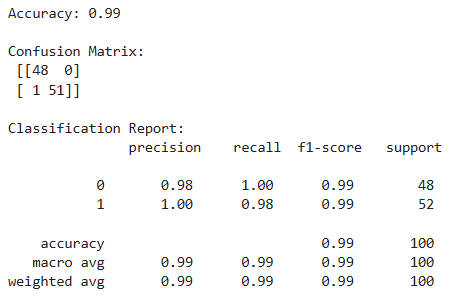
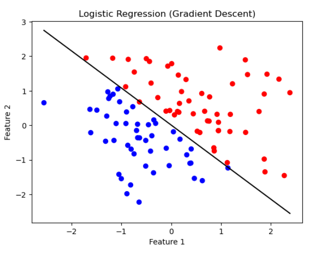

# Implementation-of-Logistic-Regression-Using-Gradient-Descent

## AIM:
To write a program to implement the the Logistic Regression Using Gradient Descent.

## Equipments Required:
1. Hardware – PCs
2. Anaconda – Python 3.7 Installation / Jupyter notebook

## Algorithm
1. 
2. 
3. 
4. 

## Program:

## Developed by: HEMALISHA T
## RegisterNumber: 212225040123

```
import numpy as np
import matplotlib.pyplot as plt
from sklearn.metrics import confusion_matrix, classification_report, accuracy_score

np.random.seed(0)
X = np.random.randn(100, 2)
y = (X[:, 0] + X[:, 1] > 0).astype(int)

def sigmoid(z):
    return 1 / (1 + np.exp(-z))

weights = np.zeros(2)
bias = 0
lr = 0.1
epochs = 1000

for _ in range(epochs):
    linear_model = np.dot(X, weights) + bias
    y_pred = sigmoid(linear_model)

    dw = (1/len(X)) * np.dot(X.T, (y_pred - y))
    db = (1/len(X)) * np.sum(y_pred - y)

    weights -= lr * dw
    bias -= lr * db

probabilities = sigmoid(np.dot(X, weights) + bias)
y_pred_final = (probabilities >= 0.5).astype(int)

print("Accuracy:", accuracy_score(y, y_pred_final))
print("\nConfusion Matrix:\n", confusion_matrix(y, y_pred_final))
print("\nClassification Report:\n", classification_report(y, y_pred_final))

plt.scatter(X[:, 0], X[:, 1], c=y, cmap='bwr')

x_vals = np.array([min(X[:, 0]), max(X[:, 0])])
y_vals = -(weights[0]*x_vals + bias) / weights[1]

plt.plot(x_vals, y_vals, color='black')

plt.title("Logistic Regression (Gradient Descent)")
plt.xlabel("Feature 1")
plt.ylabel("Feature 2")
plt.show()

```


## Output:




## Result:
Thus the program to implement the the Logistic Regression Using Gradient Descent is written and verified using python programming.

